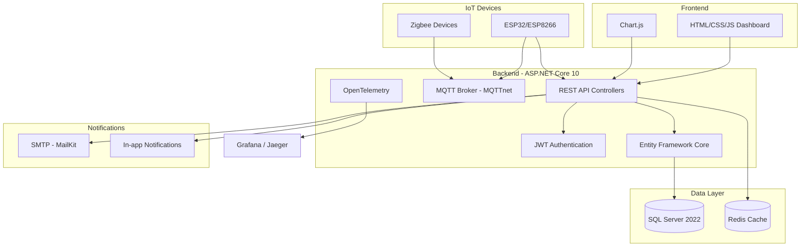

# 🏗️ Công Nghệ Sử Dụng — AeroponicIOT

Tổng quan toàn bộ công nghệ được sử dụng trong dự án **AeroponicIOT** — Hệ thống giám sát và điều khiển trang trại thông minh.

---

## 🧱 Backend

| Công Nghệ | Mô Tả |
|-----------|-------|
| **.NET 10** (`net10.0`) | Nền tảng runtime chính — ASP.NET Core Web API |
| **Entity Framework Core 10** | ORM — thao tác cơ sở dữ liệu |
| **SQL Server 2022** | Cơ sở dữ liệu quan hệ chính |
| **Redis 7 (Alpine)** | Bộ nhớ đệm (cache) — qua `StackExchange.Redis` |
| **Swagger / OpenAPI** | Tài liệu API tự động (Swashbuckle) |

## 🔐 Bảo Mật & Xác Thực

| Công Nghệ | Mô Tả |
|-----------|-------|
| **JWT Bearer** | Xác thực người dùng bằng token JWT |
| **BCrypt** | Mã hóa mật khẩu |
| **RBAC** | Phân quyền dựa trên vai trò (Farmer, Administrator) |
| **Device Provisioning** | Cấp phát thiết bị IoT qua shared key + mã claim |
| **Rate Limiting** | Giới hạn tần suất yêu cầu (ASP.NET Core built-in) |
| **CORS** | Cấu hình Cross-Origin Resource Sharing |

## 📡 IoT & Truyền Thông

| Công Nghệ | Mô Tả |
|-----------|-------|
| **MQTTnet** | Broker MQTT tích hợp sẵn (cổng 1883) — giao tiếp thời gian thực với thiết bị IoT |
| **Zigbee2MQTT Bridge** | Hỗ trợ tích hợp Zigbee (tuỳ chọn) |
| **HTTP Sensor Ingestion** | API HTTP dự phòng khi MQTT không khả dụng (dùng `X-Device-Key`) |
| **TLS / mTLS** | Hỗ trợ bảo mật MQTT qua chứng chỉ |

## 🎨 Frontend (Dashboard)

| Công Nghệ | Mô Tả |
|-----------|-------|
| **HTML5 / CSS3 / JavaScript** | Thuần — không sử dụng framework SPA |
| **Chart.js** | Biểu đồ thời gian thực và dữ liệu lịch sử (CDN) |

## 📧 Thông Báo

| Công Nghệ | Mô Tả |
|-----------|-------|
| **MailKit** | Gửi email SMTP (Gmail, …) |
| **In-app Notifications** | Thông báo hiển thị trực tiếp trên Dashboard |

## 🔍 Giám Sát & Quan Sát Hệ Thống

| Công Nghệ | Mô Tả |
|-----------|-------|
| **OpenTelemetry** | Tracing, metrics, runtime instrumentation |
| **OTLP Exporter** | Xuất dữ liệu ra Grafana, Jaeger, … |
| **Correlation ID Middleware** | Theo dõi request xuyên suốt hệ thống |
| **Performance Budget Middleware** | Cảnh báo khi hiệu năng vượt ngưỡng |
| **Request Logging Middleware** | Ghi log cấu trúc cho mọi request |

## 🧪 Kiểm Thử

| Công Nghệ | Mô Tả |
|-----------|-------|
| **xUnit / .NET Test** | Unit tests trong `AeroponicIOT.Tests` |
| **Global Exception Handling** | Xử lý ngoại lệ tập trung toàn cục |
| **Domain Validation** | Validation nghiệp vụ với `DomainValidationException` |

## 🐳 Triển Khai (DevOps)

| Công Nghệ | Mô Tả |
|-----------|-------|
| **Docker Compose** | 3 services: `app` (ASP.NET), `db` (SQL Server), `redis` (Redis) |
| **Dockerfile** | Đóng gói ứng dụng thành container |

## ⚙️ Firmware (Vi Điều Khiển)

| Công Nghệ | Mô Tả |
|-----------|-------|
| **ESP32 / ESP8266** | Vi điều khiển — lập trình bằng Arduino framework (C++) |
| **WiFi / HTTPClient** | Kết nối WiFi và gọi REST API |
| **ArduinoJson** | Xử lý dữ liệu JSON trên thiết bị nhúng |
| **PubSubClient** | Giao tiếp MQTT từ thiết bị |
| **DHT / BH1750** | Cảm biến nhiệt độ, độ ẩm, ánh sáng |
| **Self-Registration** | Cơ chế tự đăng ký thiết bị với provisioning key |

---

## 📊 Sơ Đồ Kiến Trúc Tổng Quan

---

📅 **Cập nhật lần cuối:** 2026-06-09
